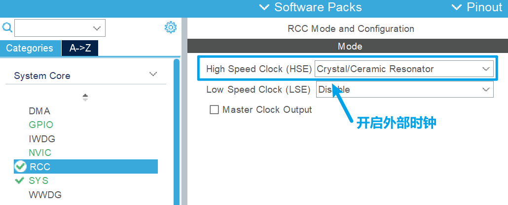
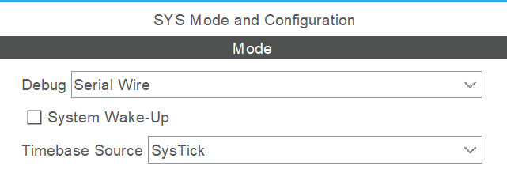
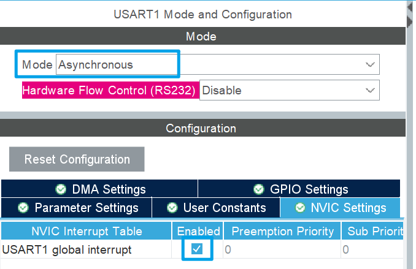
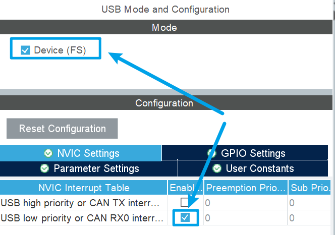
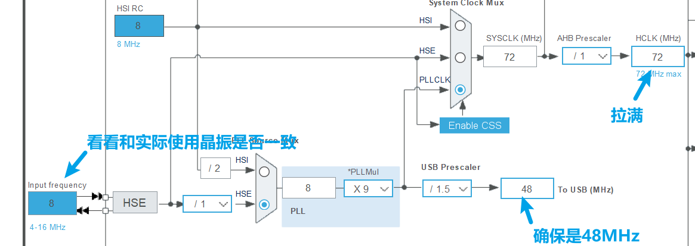
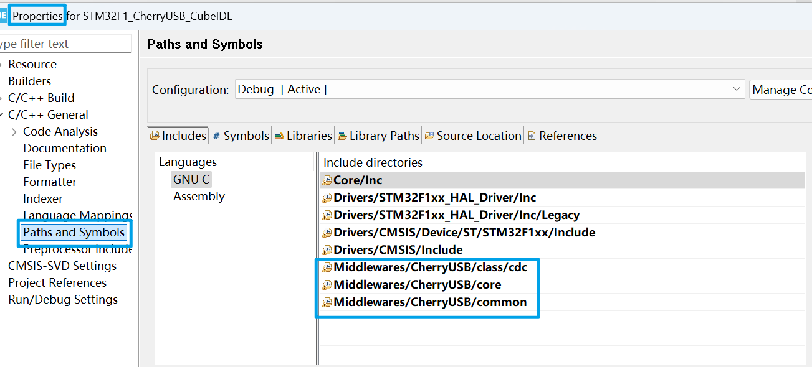
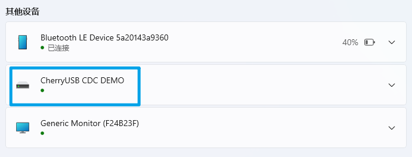
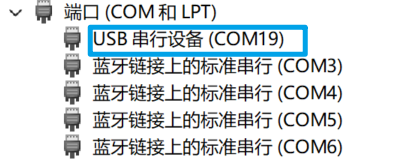

## 一.CubeIDE/CLion环境下

### 1.F1

#### (1)CubeMX配置

1. 使用 **stm32cubemx** 创建工程，配置基本的 RCC、UART (作为log使用)

   

   

   

2. 对于F1系列使用的是fsdev ip,故直接勾选**USB**并打开**RX0**中断即可

   

3. 查看默认的外部时钟值与实际使用晶振是否一致，并确保USB Clock为48M

   

#### (2)移植

**前言:** 本次跑cdc_acm_template.c模板工程，以自己实际需求稍作调整即可

1. 新增一个Middlewares文件夹将CherryUSB的源代码放进去

   这个任意，但我这种的如果再次使用CubeMX生成工程会覆盖，可以考虑丢到Drive文件夹中

2. 进入到CubeIDE中，添加CherryUSB的核心文件夹

   

3. 并进入到工程cmake文件中，把下面的文件加入到编译当中去

   这个==每次重新生成工程都会消失==，其中usbd_cdc.c和cdc_acm_template.c是根据本次要跑的模板工程导入的

   ```cmake
   file(GLOB_RECURSE SOURCES
           "Core/*.*"
           "Drivers/*.*"
           "Middlewares/CherryUSB/core/usbd_core.c"
           "Middlewares/CherryUSB/class/cdc/usbd_cdc.c"
           "Middlewares/CherryUSB/port/fsdev/usb_dc_fsdev.c"
           "Middlewares/CherryUSB/demo/cdc_acm_template.c"
   )
   ```

4. 在CherryUSB源码中拷贝一份 **cherryusb_config_template.h**，放到 Core/Inc 目录下，并命名为 usb_config.h

5. 进入到usb_config.h文件中，对于F1系列使用fsdev ip，接触下面宏定义的注释

   ```c
   #define CONFIG_USBDEV_FSDEV_PMA_ACCESS 2 // maybe 1 or 2, many chips may have a difference
   ```

6. 在main.c中，Ctrl+左键进入到`MX_USB_PCD_Init()`函数，进入到usb.c文件，将`HAL_PCD_MspInit()`函数的值拷贝到`usb_dc_low_level_init()`函数中去，并屏蔽St生成的USB初始化，即将`HAL_PCD_MspInit()`注释掉即可

   ```c
   void usb_dc_low_level_init(void){
       __HAL_RCC_USB_CLK_ENABLE();
       /* USB interrupt Init */
       HAL_NVIC_SetPriority(USB_LP_CAN1_RX0_IRQn, 0, 0);
       HAL_NVIC_EnableIRQ(USB_LP_CAN1_RX0_IRQn);
   }
   ```

7. 接着在刚刚在CubeMX中配置的中断对应的中断函数中调用USBD_IRQHandler，并传入 busid

   对应STM32F103ZET6而言，就是下面的中断函数，做以下修改

   ```c
   void USB_LP_CAN1_RX0_IRQHandler(void)
   {
      //HAL_PCD_IRQHandler(&hpcd_USB_FS);
       extern void USBD_IRQHandler(uint8_t busid);
       USBD_IRQHandler(0);
   }
   ```

8. 使用`extern`的形式导入模板工程的初始化函数及测试函数，并填入busid 和USB IP的reg base，busid从0开始，不能超过 `CONFIG_USBDEV_MAX_BUS`

   ```c
   int main(void)
   {
     HAL_Init();
   
     SystemClock_Config();
   
     MX_GPIO_Init();
     MX_USART1_UART_Init();
     extern void cdc_acm_init(uint8_t busid, uint32_t reg_base);
     cdc_acm_init(0, USB_BASE);//初始化模板工程
     while (1)
     {
         extern void cdc_acm_data_send_with_dtr_test(uint8_t busid);
         cdc_acm_data_send_with_dtr_test(0);//调用模板示例函数
         HAL_Delay(100);
     }
   }
   ```

#### (3)效果

1. 不出意外的话，在系统设置的设备里就可以看到CDC设备了

   

2. 在设备管理器中也能看到

   

   

## 二.Keil环境下

参照上面，不过将文件的添加操作转换成Keil对应的逻辑即可